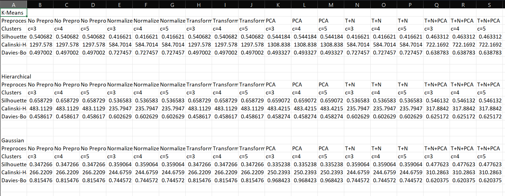

PyCaret:Comparative Study of Multiple Models

Comparitive performance study of different clustering algorithms using different pre-processing techniques with different numbers of clusters on different evaluation parameters.

Dataset used : https://archive.ics.uci.edu/dataset/109/wine

Clustering Algorithms Used :

Kmeans Clustering , Gaussian Mixture Mode Clustering , Hierarchial Clustering

Output:
